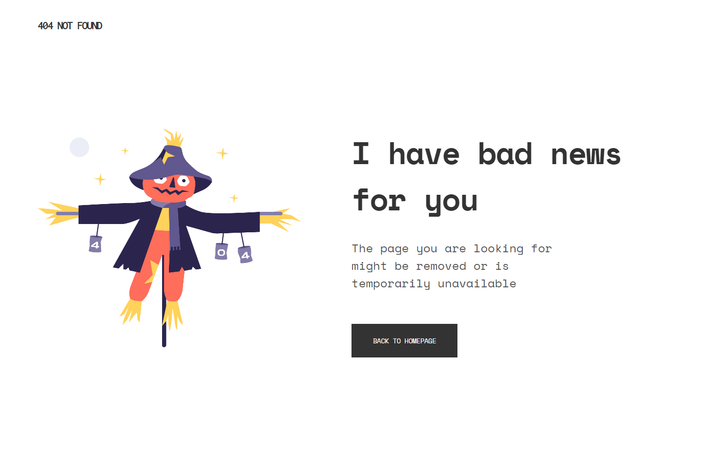

<!-- Please update value in the {}  -->

<h1 align="center">404 Page Not Found</h1>

   Solution for a challenge from  <a href="https://devchallenges.io/challenges/wBunSb7FPrIepJZAg0sY" target="_blank">Devchallenges.io</a>.

<!-- TABLE OF CONTENTS -->

## Table of Contents

- [Table of Contents](#table-of-contents)
- [Overview](#overview)
  - [Built With](#built-with)

<!-- OVERVIEW -->

## Overview

Found a cool html & css challenge on devchallenges.io, I had fun making it.\
Check the live site out: [Click Here](https://undefined-dc-404.netlify.app/)

### Built With

- HTML
- CSS
